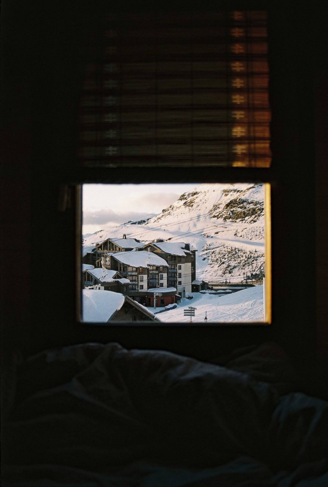

# Project 3: Spots

### Overview

-   Intro
-   Figma
-   Images
-   Tech Stack
-   Deployment

## Intro

This project is made so all the elements are displayed correctly on popular screen sizes. Interactive social media web application where users can add and remove photos, like photos of other users, and make a few minor adjustments to their profile.

## Figma

-   [Link to the project on Figma](https://www.figma.com/file/BBNm2bC3lj8QQMHlnqRsga/Sprint-3-Project-%E2%80%94-Spots?type=design&node-id=2%3A60&mode=design&t=afgNFybdorZO6cQo-1)

## Images

          

## Tech Stack

-   HTML
-   CSS
-   Responsive Design

## Deployment

This webpage is deployed to Github Pages

-   Deployment Link
